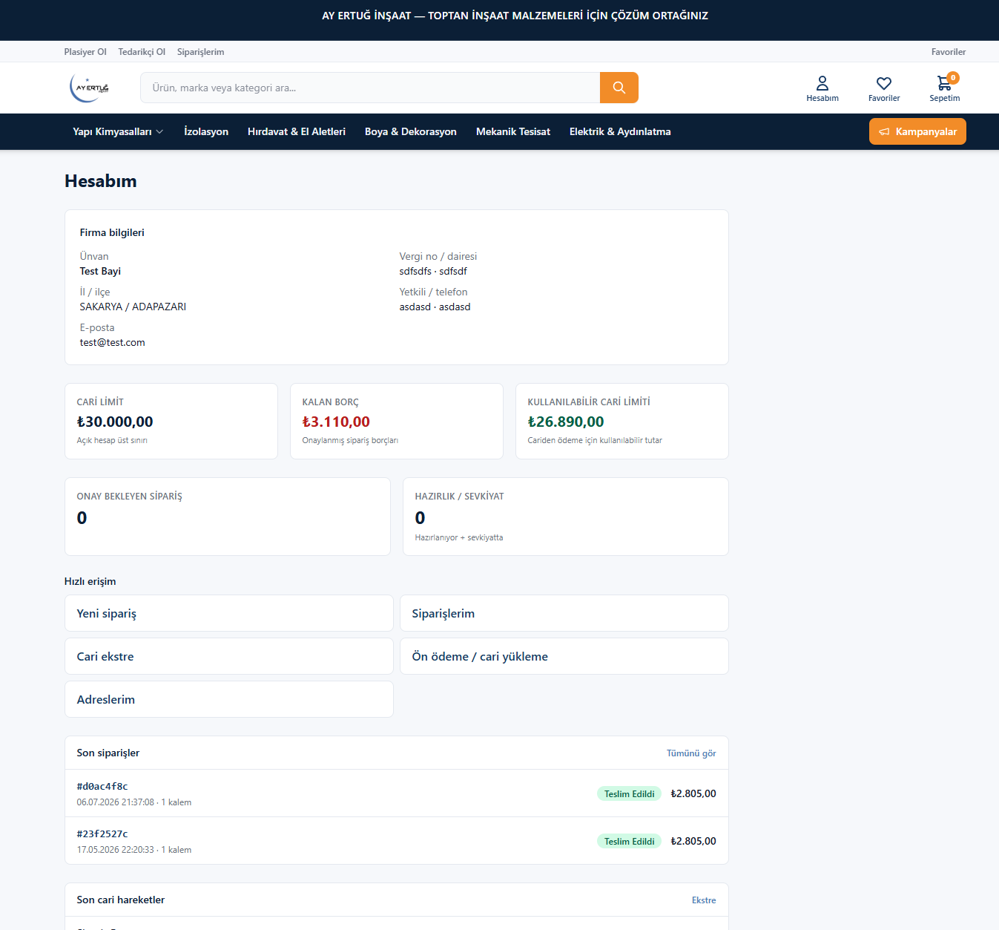
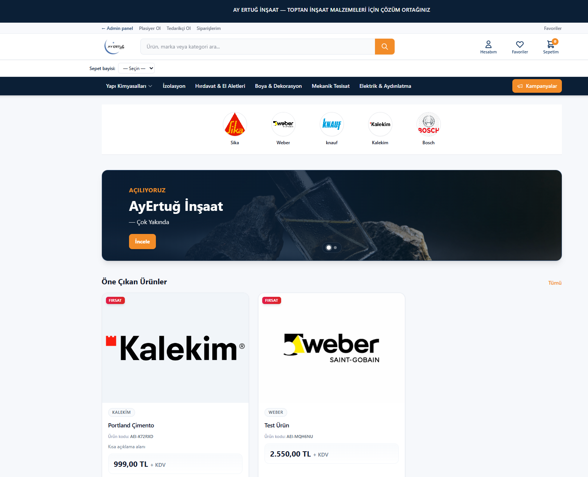
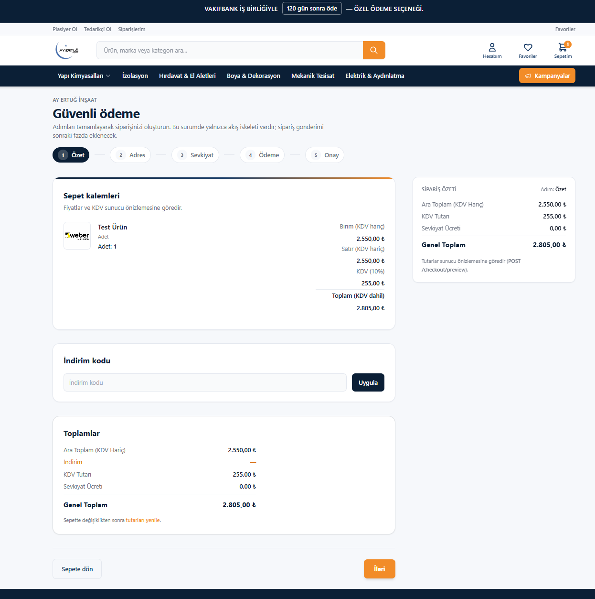
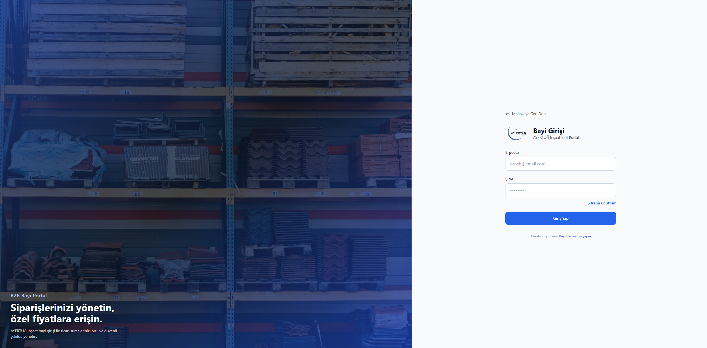
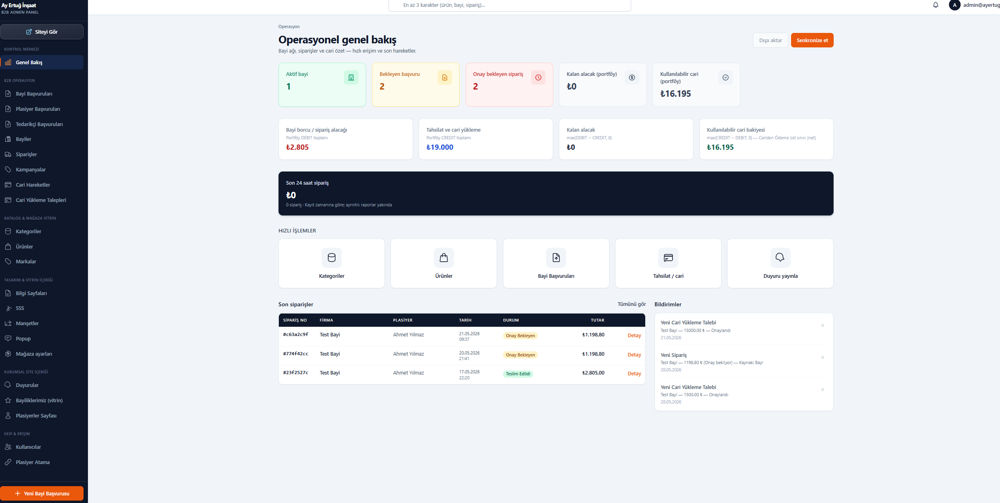

# AyErtuğ B2B Dealer Portal — Case Study

A production B2B commerce and dealer management platform designed for approximately 150 dealers.

> The source code is private because this is a commercial client project. This repository documents the system architecture, implemented modules and technical decisions without exposing confidential code or business data.

## Project Overview

The platform allows dealers, sales representatives and administrators to manage products, orders, collections, account balances and delivery processes from separate role-based interfaces.

## My Responsibilities

- Requirements analysis
- System architecture
- Database modelling
- Backend development
- Frontend development
- Authentication and authorization
- Deployment and server configuration
- CDN and asset storage configuration
- Testing and production troubleshooting
- AI-assisted development and code review

## Tech Stack

### Frontend

- Next.js
- TypeScript
- React

### Backend

- NestJS
- Prisma
- PostgreSQL
- JWT authentication

### Infrastructure

- Docker
- Ubuntu
- Plesk
- Cloudflare R2
- Cloudflare CDN

## Core Modules

- Dealer application and approval
- Dealer, salesperson and administrator roles
- Product, category and variant management
- Dealer-specific ordering
- Order approval and delivery workflows
- Collection and account ledger management
- Credit limit controls
- Currency rate integration
- Document and asset storage
- Administrative reporting

## Architecture

```mermaid
flowchart TD
    A[Dealer / Salesperson / Admin] --> B[Next.js Applications]
    B --> C[NestJS REST API]
    C --> D[PostgreSQL]
    C --> E[Prisma ORM]
    C --> F[Cloudflare R2]
    C --> G[TCMB Exchange Rate Service]

## Screenshots

The screenshots below use anonymized or demo data. No real customer or financial information is exposed.

### Dealer dashboard

Overview of the dealer account, financial summary and recent order activity.



### Product catalogue

Product listing with category, brand, variant and pricing information.



### Order management

Order workflow used by dealers, sales representatives and administrators.



### Login

Dealer login.



### Dealer administration

Administrative interface for dealer management, salesperson assignment and credit limits.


